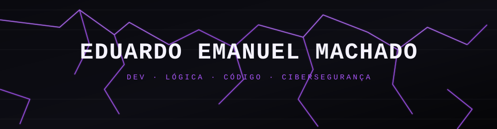

<div align="center">



<p>
Não estou aqui pra impressionar ninguém. Estou aqui porque sou bom no que faço,<br/>
e quem entrar nesse perfil vai perceber isso rápido.
</p>


</div>

<br/>

## ▓ Sobre

Sou estudante de Desenvolvimento de Sistemas e estou construindo minha base em Python e JavaScript com a intenção de dominar de verdade, não só "saber usar". Enquanto a maioria fica satisfeita copiando exemplo de tutorial, eu quero entender a lógica por trás de cada linha. É assim que se constrói algo sólido.

Meu foco agora é backend e sistemas — cibersegurança está no radar como próximo capítulo. Não é modinha, é rota.

```yaml
nome: "Eduardo Emanuel Machado"
formação: "Desenvolvimento de Sistemas - SENAI/SC"
foco_atual: ["Python", "JavaScript"]
próximo_passo: "Cibersegurança"
princípio: "Entender o porquê, não só o como"
```

<br/>

## ▓ Stack

<div align="left">


</div>

<br/>

## ▓ Estatísticas

<div align="left">


</div>

<br/>

## ▓ Fora do código

Quando não estou programando, estou construindo outra coisa: histórias, personagens, mundos inteiros através do mangá que escrevo. Criar do zero — seja um sistema ou uma narrativa — é o que me move.

Também curto jogo de estratégia e gestão. Faz sentido: gosto de pensar várias jogadas à frente, dentro e fora da tela.

<br/>

## ▓ Repositórios

> Fixados abaixo. É só o começo.

<br/>

<div align="center">
<sub>feito com lógica, café e uma boa dose de teimosia</sub>
</div>

